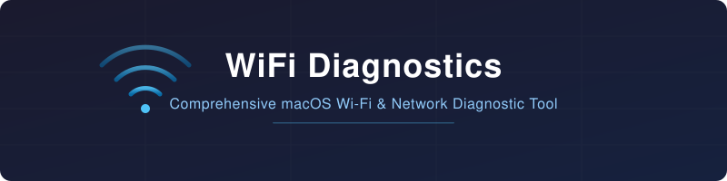

<p align="center">
  
</p>

<p align="center">
  
  
  <a href="LICENSE"></a>
  <a href="https://github.com/ravinald/wifidiagnostics/releases/latest"></a>
</p>

<p align="center">
  A macOS menu bar app for comprehensive Wi-Fi and network diagnostics.
</p>

---

## Features

- **Wi-Fi Info** — SSID, BSSID, RSSI, SNR, channel, PHY mode, security type
- **Nearby Networks** — scan visible access points with signal strength and channel
- **Channel Utilization** — identify congestion and interference on your channel
- **Network Interfaces** — enumerate all active interfaces with addresses
- **Active Connections** — list established TCP/UDP connections
- **Routing & ARP Tables** — display the current routing table and ARP cache
- **DNS Resolution** — test DNS lookups against configurable hostnames
- **Ping & Latency** — measure round-trip times to configurable targets
- **DHCP Lease** — show current lease details
- **Captive Portal Detection** — check for captive portal redirects
- **mDNS / Bonjour Discovery** — discover local network services
- **Firewall, VPN & Proxy Status** — detect active firewall rules, VPN tunnels, and proxy configurations
- **Configurable Host Checks** — customize the list of DNS, ping, TCP, and HTTPS targets
- **Structured Reports** — generate plain-text diagnostic reports for easy sharing
- **CLI Mode** — run diagnostics from the terminal without launching the GUI

<!-- TODO: Add screenshot of the menu bar app and a sample report -->

## Installation

### Download

Grab the latest DMG from [GitHub Releases](https://github.com/ravinald/wifidiagnostics/releases/latest), open it, and drag **WiFi Diagnostics** to your Applications folder.

### Build from Source

See [Building from Source](#building-from-source) below.

## Usage

### Menu Bar

Launch the app — it lives in the macOS menu bar. Click the icon and select **Generate WiFi Diagnostics** to produce a full report. The report is saved to a file and can be opened directly from the menu.

Use **Host Checks...** to configure which hosts are tested for DNS resolution, ping, TCP connectivity, and HTTPS reachability.

### CLI Mode

Run diagnostics from the terminal:

```bash
# Print report to stdout
WiFiDiagnostics.app/Contents/MacOS/WiFiDiagnostics --cli

# Short flags — stdout
WiFiDiagnostics.app/Contents/MacOS/WiFiDiagnostics -c -s

# Save to a specific path
WiFiDiagnostics.app/Contents/MacOS/WiFiDiagnostics -c -o ~/Desktop/wifi-report.txt
```

## Permissions

**Location Services** — WiFi Diagnostics requests location access because macOS requires Location Services authorization to read BSSID values and scan for nearby Wi-Fi networks. Without it, the app can still report most network information but Wi-Fi-specific details (BSSID, nearby networks, channel utilization) will be unavailable.

You can grant or revoke this in **System Settings > Privacy & Security > Location Services**.

## Building from Source

Requires **Xcode 16+** and **macOS 15.5+**.

```bash
# Clone the repository
git clone https://github.com/ravinald/wifidiagnostics.git
cd wifidiagnostics

# Build
DEVELOPER_DIR=/Applications/Xcode.app/Contents/Developer \
  xcodebuild -scheme WiFiDiagnostics -configuration Release build
```

The built app bundle will be in the derived data build directory.

## License

Licensed under the [Apache License 2.0](LICENSE).

Copyright Ravi Pina.
